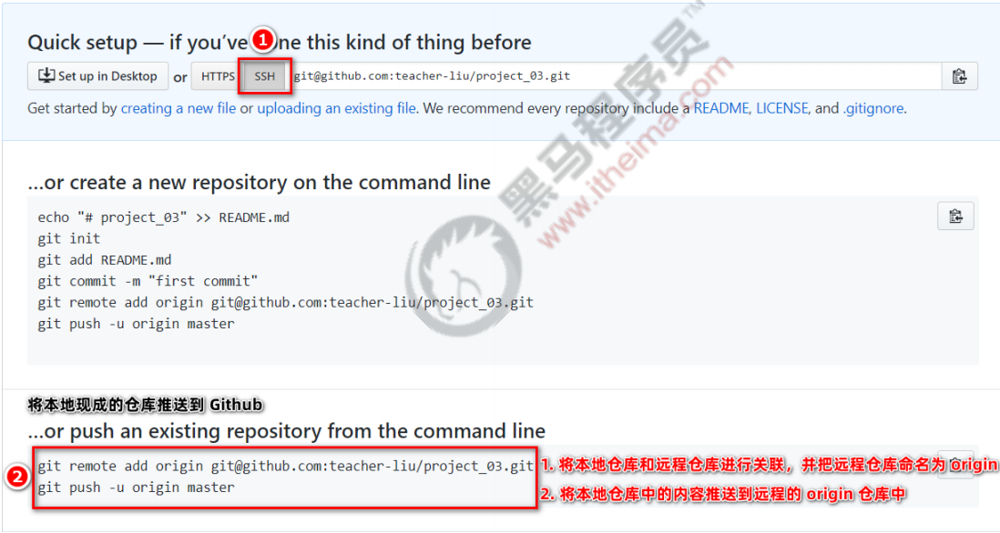
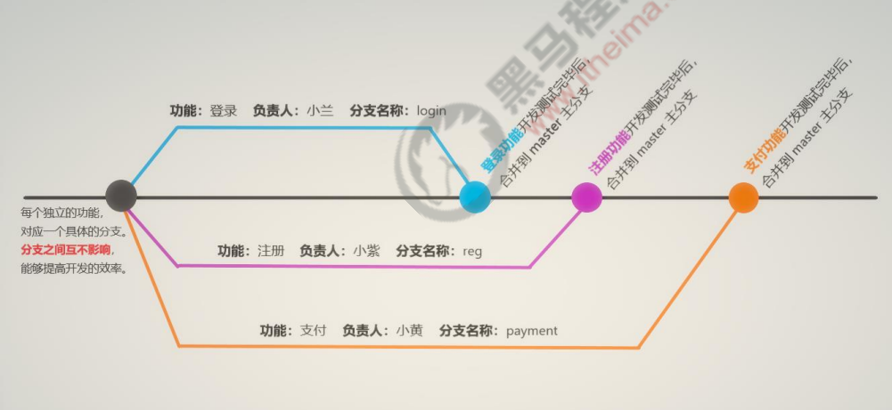
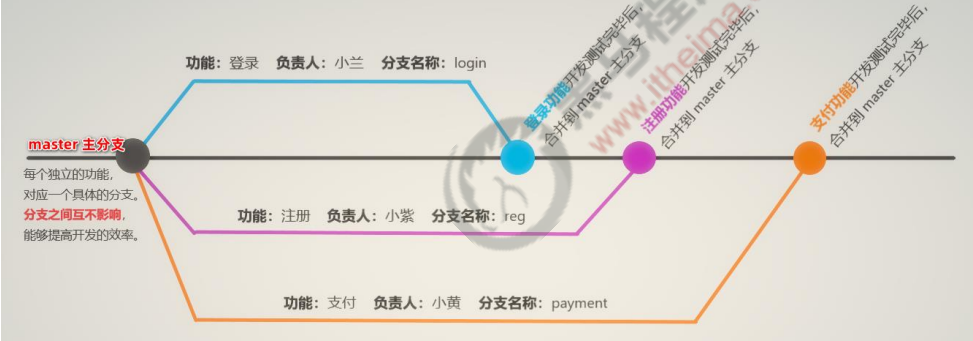
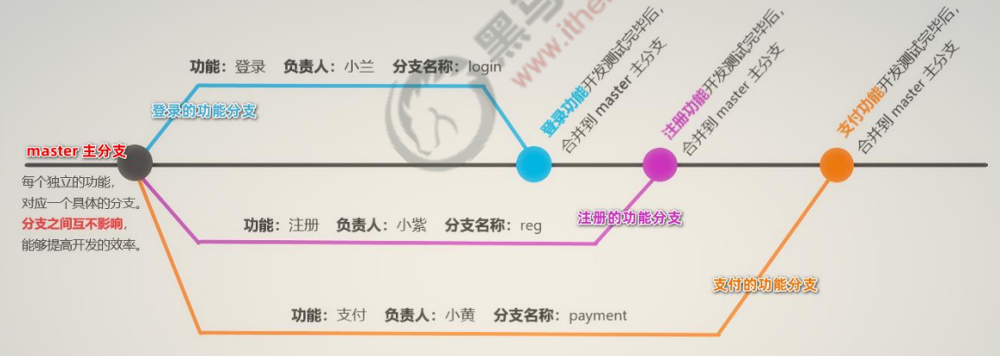

# 目标

- 能够使用 `Github` 创建和维护远程仓库
- 能够掌握 `Git` 分支的基本使用

# 一、了解开源相关的概念

## 什么是开源


**通俗的理解**

- **开源**是指不仅提供程序还提供程序的源代码

- **闭源**是只提供程序，不提供源代码

## 什么是开源许可协议

开源并不意味着完全没有限制，为了**限制使用者的使用范围**和**保护作者的权利**，每个开源项目都应该遵守开源

许可协议（ `Open Source License` ）。

### 常见的 5 种开源许可协议

- `BSD`（Berkeley Software Distribution） 
- `Apache Licence 2.0`
- **`GPL`**（GNU General Public License） (⭐⭐⭐)
- 具有传染性的一种开源协议，不允许修改后和衍生的代码做为闭源的商业软件发布和销售
  - 使用 `GPL` 的最著名的软件项目是：Linux
- `LGPL`（GNU Lesser General Public License） 
- **`MIT`**（Massachusetts Institute of Technology, MIT）  (⭐⭐⭐)
- 是目前限制最少的协议，唯一的条件：在修改后的代码或者发行包中，必须包含原作者的许可信息
- 使用 MIT 的软件项目有：`jquery`、`Node.js`

## 为什么要拥抱开源

开源的核心思想是“**我为人人，人人为我**”，人们越来越喜欢开源大致是出于以下 3 个原因：

① 开源给使用者更多的控制权

② 开源让学习变得容易

③ 开源才有真正的安全

开源是软件开发领域的大趋势，**拥抱开源就像站在了巨人的肩膀上**，不用自己重复造轮子，让开发越来越容易

## 开源项目托管平台

专门用于免费存放开源项目源代码的网站，叫做**开源项目托管平台**。目前世界上比较出名的开源项目托管平台

主要有以下 3 个：

- `Github`（全球最牛的开源项目托管平台，没有之一）
- `Gitlab`（对代码私有性支持较好，因此企业用户较多）
- `Gitee`（又叫做码云，是国产的开源项目托管平台。访问速度快、纯中文界面、使用友好）

**注意：**以上 3 个开源项目托管平台，只能托管以 `Git` 管理的项目源代码，因此，它们的名字都以 `Git` 开头

# 二、远程仓库之`Github`（★）

## 【1】什么是 `Github`

`Github` 是全球最大的**开源项目**托管平台。因为只支持 `Git` 作为唯一的版本控制工具，故名 `GitHub`。 

在 `Github` 中，你可以：

① 关注自己喜欢的开源项目，为其点赞打 `call` 

② 为自己喜欢的开源项目做贡献（`Pull Request`） 

③ 和开源项目的作者讨论 Bug 和提需求 （`Issues`） 

④ 把喜欢的项目复制一份作为自己的项目进行修改（`Fork`） 

⑤ 创建属于自己的开源项目

⑥ etc…

So，**`Github ≠ Git`**

## 【2】注册github账号

### 注册 `Github` 账号的流程

① 访问 `Github` 的官网首页 https://github.com/

② 点击“`Sign up`”按钮跳转到注册页面

③ 填写可用的用户名、邮箱、密码

④ 通过点击箭头的形式，将验证图片摆正

⑤ 点击“`Create account`”按钮注册新用户

⑥ 登录到第三步填写的邮箱中，点击激活链接，完成注册


### 激活 `Github` 账号


### 完成注册


## 【3】远程仓库的使用

### 新建空白远程仓库


### 新建空白远程仓库成功


## 【4】本地仓库与远程仓库建立连接

### 4.1 远程仓库的两种访问方式

`Github` 上的远程仓库，有两种访问方式，分别是 `HTTPS` 和 `SSH`。它们的区别是：

① `HTTPS`：**零配置**；但是每次访问仓库时，需要重复输入 `Github` 的账号和密码才能访问成功

② `SSH`：**需要进行额外的配置**；但是配置成功后，每次访问仓库时，不需重复输入 `Github` 的账号和密码

**注意：**在实际开发中，**推荐使用 SSH 的方式访问远程仓库。**

### 4.2 基于 `HTTPS` 


### 4.3 基于 SSH key(⭐⭐⭐)

#### `SSH key`

`SSH key` 的**作用**：实现本地仓库和 `Github` 之间免登录的加密数据传输。

`SSH key` 的**好处**：免登录身份认证、数据加密传输。

`SSH key` 由**两部分组成**，分别是：

① `id_rsa`（私钥文件，存放于客户端的电脑中即可）

② `id_rsa.pub`（公钥文件，需要配置到 `Github` 中）

#### 生成 SSH key

① 打开 Git Bash

② 粘贴如下的命令，并将 `your_email@example.com` 替换为注册 `Github` 账号时填写的邮箱：

-  `ssh-keygen -t rsa -b 4096 -C "your_email@example.com"` 

③ 连续敲击 3 次回车，即可在 `C:\Users\用户名文件夹\.ssh` 目录中生成 `id_rsa` 和 `id_rsa.pub` 两个文件

#### 配置 SSH key

① 使用记事本打开 `id_rsa.pub` 文件，复制里面的文本内容

② 在浏览器中登录 `Github`，点击头像 -> `Settings -> SSH and GPG Keys -> New SSH key`

③ 将 `id_rsa.pub` 文件中的内容，粘贴到 `Key` 对应的文本框中

④ 在 `Title` 文本框中任意填写一个名称，来标识这个 `Key` 从何而来

#### 检测 `Github` 的 `SSH key` 是否配置成功

- 打开 `Git Bash`，输入如下的命令并回车执行：

  ```shell
  ssh -T git@github.com
  
  或者
  ssh -T git@gitee.com
  ```

- 上述的命令执行成功后，可能会看到如下的提示消息：

  

- 输入 `yes` 之后，如果能看到类似于下面的提示消息，证明 `SSH key` 已经配置成功了：

  

#### 基于 SSH 将本地仓库上传到 `Github`



**注意：** `git push origin master` 也能进行提交，`git push origin -u` 的话可以提交代码，并且把`origin` 当作默认的主机，后续直接 `git push` 就可以提交到`origin`对应的主机

### 4.4 查看连接和删除连接

> git  remote -v  【查看有没有跟远程仓库建立联系】
>
>  
>
> git remote remove origin 【删除已经建立的联系】

## 【5】将远程仓库克隆到本地

打开 `Git Bash`，输入如下的命令并回车执行：

```shell
git clone 远程仓库的地址
```

# 三、`Git`本地分支（★）

## 【1】分支基础

### 1.1 分支的概念

分支就是科幻电影里面的平行宇宙，当你正在电脑前努力学习Git的时候，另一个你正在另一个平行宇宙里努力学习`SVN`。如果两个平行宇宙互不干扰，那对现在的你也没啥影响。不过，在某个时间点，两个平行宇宙合并了，结果，你既学会了`Git`又学会了`SVN`！


### 1.2 分支在实际开发中的作用

在进行多人协作开发的时候，为了防止互相干扰，提高协同开发的体验，建议每个开发者都基于分支进行项目

功能的开发，例如：



### 1.3 master 主分支

在初始化本地 `Git` 仓库的时候，`Git` 默认已经帮我们创建了一个名字叫做 `master` 的分支。通常我们把这个

`master` 分支叫做主分支。



在实际工作中，`master` 主分支的作用是：**用来保存和记录整个项目已完成的功能代码**。

因此，**不允许程序员直接在 `master` 分支上修改代码**，因为这样做的风险太高，容易导致整个项目崩溃。

### 1.4 功能分支

由于程序员不能直接在 `master` 分支上进行功能的开发，所以就有了功能分支的概念。

**功能分支**指的是专门用来开发新功能的分支，它是临时从 `master` 主分支上分叉出来的，当新功能开发且测试

完毕后，最终需要合并到 `master` 主分支上，如图所示：



## 【2】查看分支列表(⭐)

使用如下的命令，可以查看当前 Git 仓库中所有的分支列表：

```shell
git branch
```

运行的结果如下所示：


**注意：**分支名字前面的 ***** 号表示当前所处的分支。

## 【3】创建新分支

使用如下的命令，可以**基于当前分支**，**创建一个新的分支**，此时，新分支中的代码和当前分支完全一样：

```
git branch 分支名称
```

图示如下：


## 【4】切换分支

使用如下的命令，可以**切换到指定的分支上**进行开发：

```shell
git checkout login
```

图示如下：


## 【5】创建并切换分支(⭐)

使用如下的命令，可以**创建指定名称的新分支**，并**立即切换到新分支上**：

```shell
# -b 表示创建一个新分支
# checkout 表示切换到刚才新建的分支上
git checkout -b 分支名称
```

图示如下：


**注意：**

"`git checkout -b 分支名称`" 是下面

两条命令的简写形式：

① `git branch` 分支名称

② `git checkout` 分支名称

## 【6】合并分支（⭐⭐⭐）

功能分支的代码开发测试完毕之后，可以使用如下的命令，将完成后的代码合并到 `master` 主分支上：

```shell
# 1. 切换到 master 分支
git checkout master
# 2. 在master 分支上运行 git merge 命令，将 login 分支的代码合班到 master 分支
git merge login
```

图示如下：


**合并分支时的注意点**：

假设要把 C 分支的代码合并到 A 分支，

则必须**先切换到 A 分支**上，**再运行 git merge 命令**，来合并 C 分支！

## 【7】删除分支

当把功能分支的代码合并到 `master` 主分支上以后，就可以使用如下的命令，删除对应的功能分支：

```shell
git branch -d 分支名称
```

图示如下：


## 【8】解决分支合并时的冲突问题（⭐⭐⭐）

如果**在两个不同的分支中**，对**同一个文件**进行了**不同的修改**，Git 就没法干净的合并它们。 此时，我们需要打开

这些包含冲突的文件然后**手动解决冲突**。

```shell
# 假设：在把 reg 分支合并到 master 分支期间
git checkout master
git merge reg

# 打开包含冲突的文件，手动解决冲突之后，再执行如下命令
git add .
git commit -m "解决了分支合并冲突的问题"
```

# 四、远程仓库分支操作

## 将本地分支推送到远程仓库(⭐⭐⭐)

如果是**第一次**将本地分支推送到远程仓库，需要运行如下的命令：

```shell
# -u 表示把本地分支和远程分支进行关联，只在第一次推送的时候需要带 -u 参数
git push -u 远程仓库的别名 本地分支名称:远程分支名称

# 实际案例
git push -u origin payment:pay

# 如果希望远程分支的名称和本地分支名称保持一致，可以对命令进行简化
git push -u origin payment
```

**注意：**第一次推送分支需要带 **-u 参数**，此后可以直接使用 `git push` 推送代码到远程分支。

## 查看远程仓库中所有的分支列表

通过如下的命令，可以查看远程仓库中，所有的分支列表的信息：

```shell
git remote show 远程仓库名称
```

## 跟踪分支(⭐⭐⭐)

跟踪分支指的是：从远程仓库中，把远程分支下载到本地仓库中。需要运行的命令如下：

```shell
# 示例
git checkout pay

# 从远程仓库中，把对应的远程分支下载到本地仓库，并把下载的本地分支进行重命名
git checkout -b 本地分支名称 远程仓库名称/远程分支名称

# 示例
git checkout -b payment origin/pay
```

## 拉取远程分支的最新的代码

可以使用如下的命令，把远程分支最新的代码下载到本地对应的分支中:

```shell
# 从远程仓库，拉取当前分支最新的代码，保持当前分支的代码和远程分支代码一致
git pull
```

## 删除远程分支

可以使用如下的命令，删除远程仓库中指定的分支：

```shell
# 删除远程仓库中，制定名称的远程分支
git push 远程仓库名称 --delete 远程分支名称

# 示例
git push origin --delete pay
```

# 总结

- 能够掌握 `Git` 中基本命令的使用
  - `git init`
  - `git add .`
  - `git commit –m "提交消息"` 
  - `git status` 和 `git status -s`
- 能够使用 `Github` 创建和维护远程仓库
  - 能够配置 `Github` 的 `SSH` 访问
  - 能够将本地仓库上传到 `Github`
- 能够掌握 `Git` 分支的基本使用
  - `git checkout -b 新分支名称`
  - `git push -u origin 新分支名称`
  - `git checkout 分支名称`
  - `git branch`